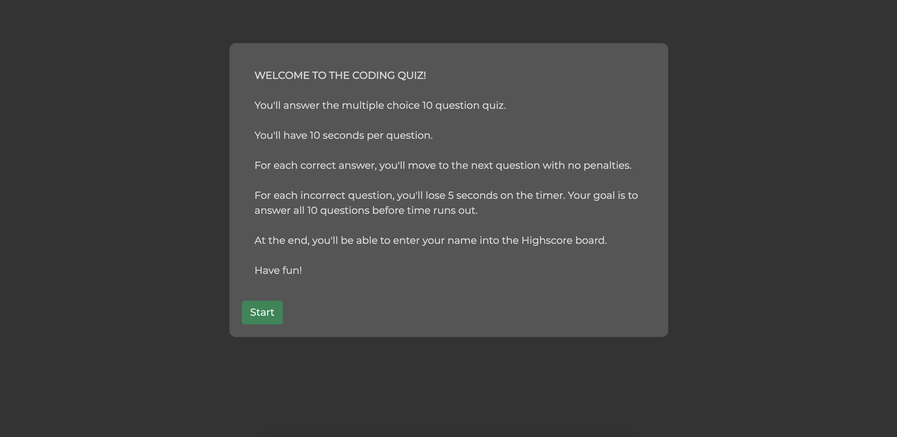
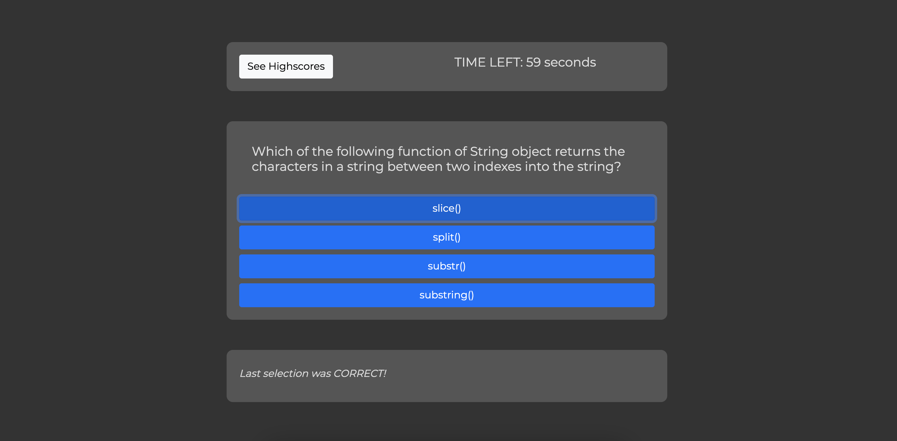
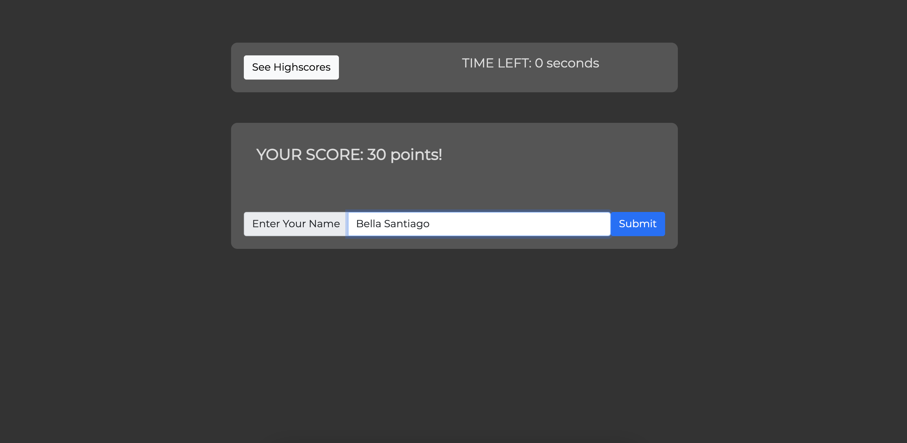
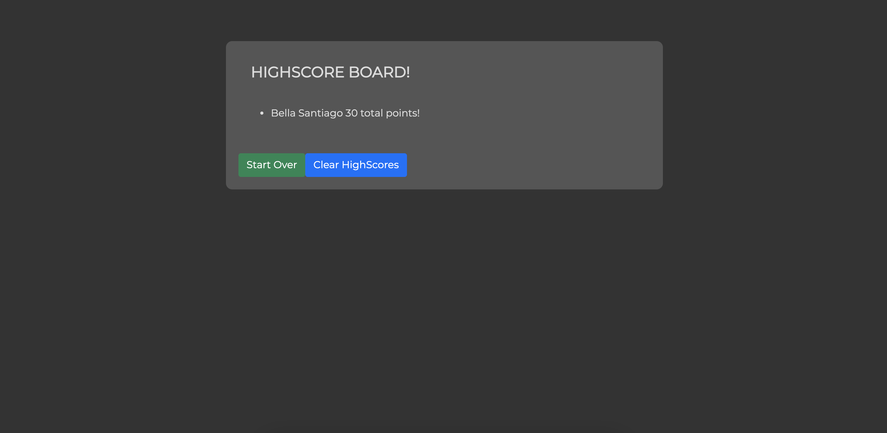

# Full-Stack Bootcamp - Week 4 Homework

## Multiple Choice Quiz
The application was designed to take the user through a mutliple choice quiz. 
The user is first presented with a welcome screen where the instructions are explained. 
Once "Start" button is pressed, user is prompted with the first question and the timer starts. 
The quiz has a total of 10 questions and 100 seconds total. 
After all 10 questions or the clock reaches zero, which ever happens first, the user is presented with total score and a field to input their name. 
Once user submits their name, the name and total score is stored in the local storage and the user is taken to the Highscore board where it can view all stores stored.  
Each correct answer, the user is presented with a feedback under the questions on their selection and: 
<i>If correct answer, the user is yielded 10 points;</i> 
<i>If incorrect answer, the user loses 5 seconds on the clock;</i> 
 
After all 10 questions or the clock reaches zero, which ever happens first, the user is presented with total score and a field to input their name. 
Once user submits their name, the name and total score is stored in the local storage and the user is taken to the Highscore board where it can view all stores stored.

## Technologies Used
HTML5 
CSS 
JavaScript

## License
MIT

## Deployed application
https://bellasantiago.github.io/hw-quiz

## Github Repository
https://github.com/bellasantiago/hw-quiz

## Finished Screenshots

## Contact the Creator
bellasantiado.adl@gmail.com